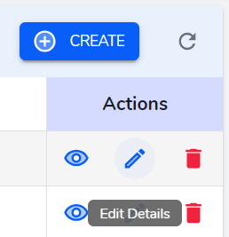

**Batch Table**

In file info page we can `create/edit/view` files.

**Create**

The fields whose label is marked with `*` must be filled. 

- `Client*` - A dropdown that provides list of client optoins.

- `Name*` - This field has a auto generated prefix which is concatenated with user provided name. The prefix is generated from client name and the current name.

- `Remarks` - A simple textfield to input remarks.

- `Select Files*` - Select the required files to create a batch.

**Table Actions**

Each List Table is provided with Action columns which has view, edit icon buttons. Hovering on these icons will show what the button does in its tooltip.

**View icon button**

    View button navigates to show page where we can view the data.

<!--  -->

**Edit icon button**

   Edit button navigates to edit page where we can edit data in the form.

<!--  -->

**Delete icon button**

   Delete button opens a modal where you can confirm to delete or not.

<!--  -->