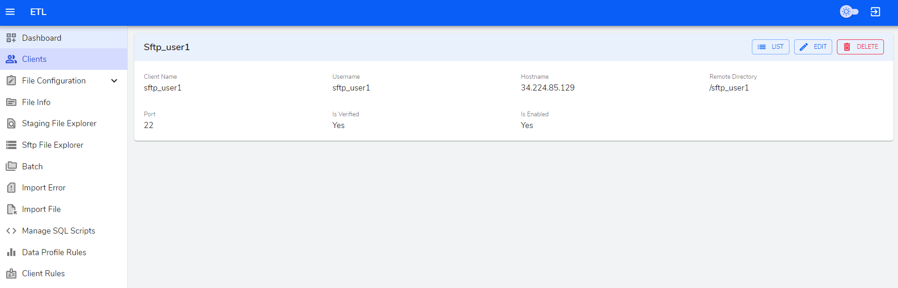
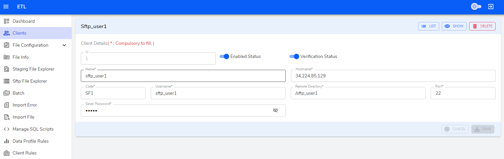

**Client Rules table**

**Create**

The fields whose label is marked with `*` must be filled. 

- `Client*` - A dropdown that provides list of client optoins.

- `Layout Code*` - A dropdown that provides list of layout code.

- `Field Name*` - A dropdown that provides list of field name.

- `Src Code*` - A simple textfield to imput src code.

- `Src Desc*` - A simple textfield to imput src decription.

- `Rollup code*` - A simple textfield to imput rollup code.

- `Remarks*` - A simple textfield to input remarks.

**Table Actions**

Each List Table is provided with Action columns which has view, edit icon buttons. Hovering on these icons will show what the button does in its tooltip.

**View icon button**

    View button navigates to show page where we can view the data.

<!--  -->

**Edit icon button**

   Edit button navigates to edit page where we can edit data in the form.

<!--  -->

**Delete icon button**

   Delete button opens a modal where you can confirm to delete or not.

<!--  -->