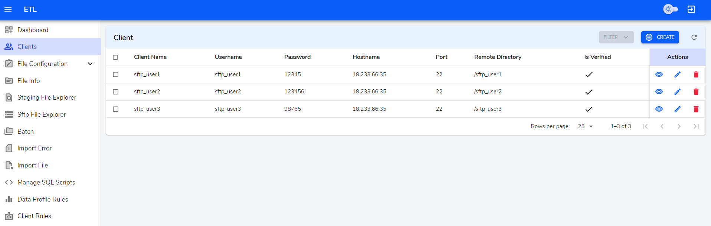
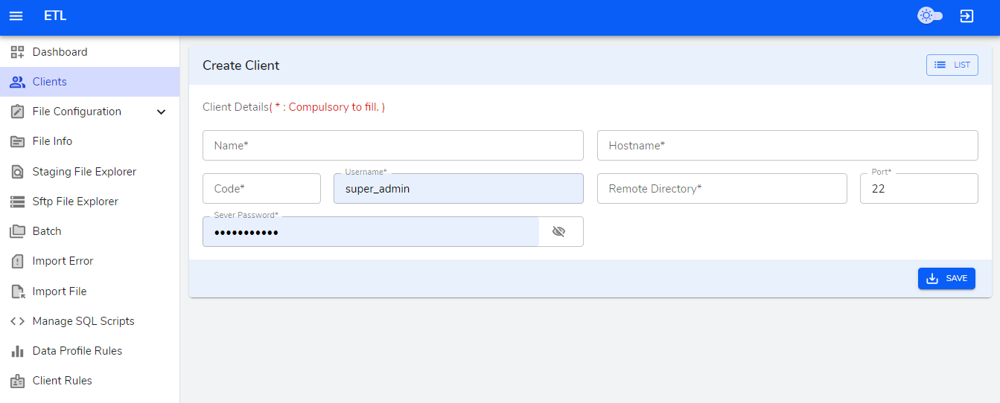
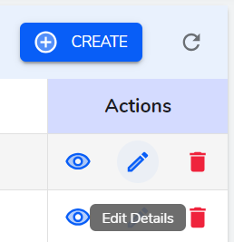
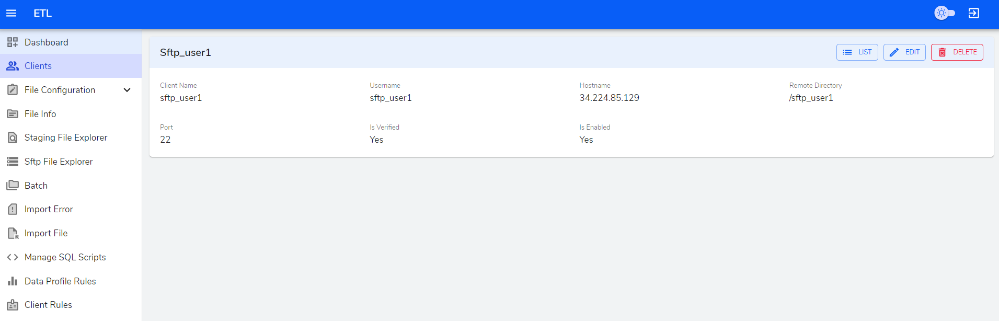
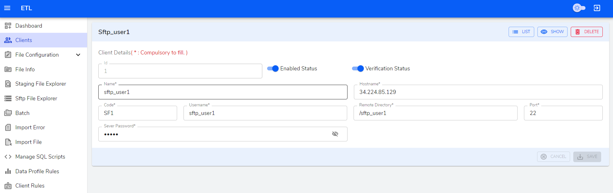
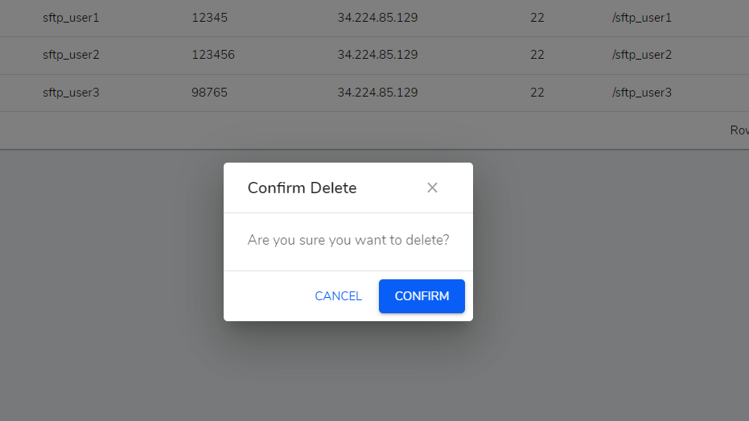

**Client Table**

In Clients page we can `create/edit/view/delete` clients.

**Create**

The fields whose label is marked with `*` must be filled. 

-  `Name*` - A simple textfield to input client name.

- `HostName*` - A simple textfield to imput host name.

- `Code*` - A simple textfield to imput code.

- `UserName*` - A simple textfield to imput username.

- `Remote Directory*` - A simple textfield to imput Remote Directory.

- `Port*` - A simple textfield to imput Port.

- `Server Password*` - A simple textfield to imput Server Password.

**Table Actions**

Each List Table is provided with Action columns which has view, edit, delete icon buttons. Hovering on these icons will show what the button does in its tooltip.

**View icon button**

    View button navigates to show page where we can view the data.

**Edit icon button**

   Edit button navigates to edit page where we can edit data in the form.

**Delete icon button**

   Delete button opens a modal where you can confirm to delete or not.

