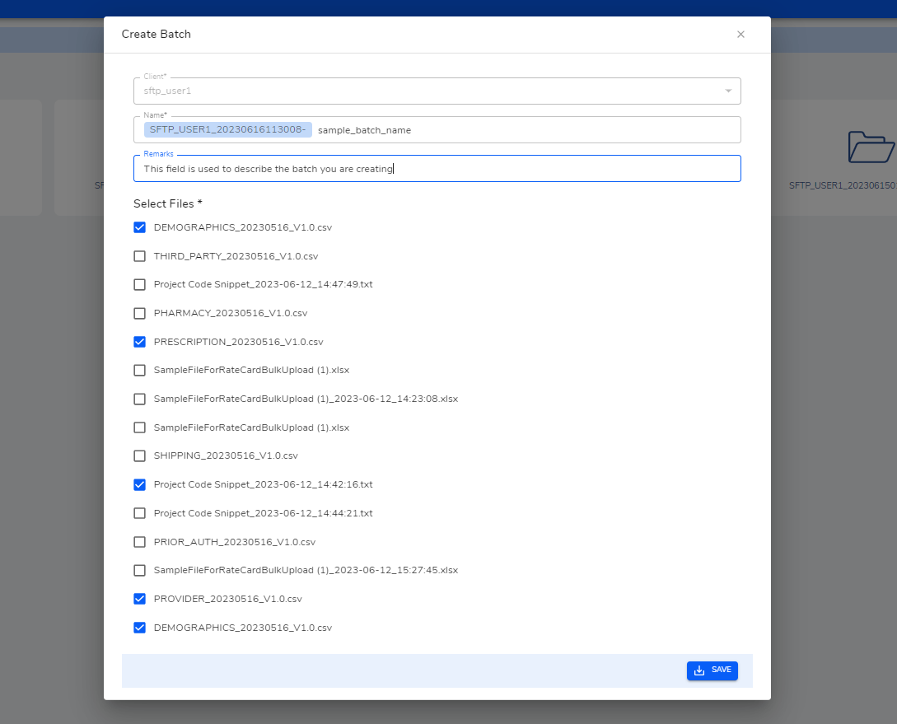

**Batch List**

Search for a batch or create batch through Create button present on the top right corner, or create new  batch From batch feature [Batch](http://localhost:3000/docs/Features/Batch). 

On clicking Create page a modal will open.

The fields whose label is marked with `*` must be filled. 

- `Client*` - The field Client is already filled and disabled. The value for this field is taken from the client chosen in the previous client list.

- `Name*` - This field has a auto generated prefix which is concatenated with user provided name. The prefix is generated from client name and the current name.

- `Remarks` - This field is used to describe remarks.

- `Select Files*` - Select the required files to create a batch.

Click `Save` to submit and create batch.