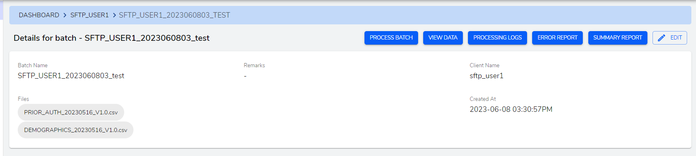

**View Batch**

This page provides PROCESS BATCH, VIEW DATA, PROCESSING LOGS, ERROR REPORT, SUMMARY REPORT and EDIT.
-  `PROCESS BATCH` - This is used to process batch.
- `VIEW DATA` - This is used to view data of the batch. It opens a modal with `layout Code*` and `Operation Id*` select field. Select these fields layout code and operation id and search to get desired batch data.

- `PROCESSING LOGS` - View processed logs. It opens a modal with a simple table displaying the processed logs. 

- `ERROR REPORT` - View errors. It opens a modal with a simple table displaying the errors from batch processing.

- `SUMMARY REPORT` - View summary report of the batch. It opens a modal with a simple table displaying the summaty from batch processing.

- `EDIT` - Provides option to edit the batch.