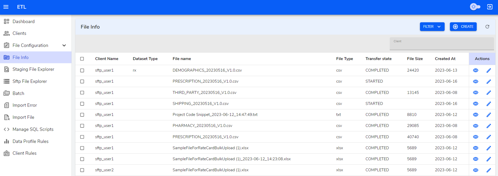

**File Info Table**

In file info page we can `create/edit/view` files.

**Create**

The fields whose label is marked with `*` must be filled. 

- `Client*` - A dropdown that provides list of client optoins.

- `Transfer State*` - A simple textfield to input transfer state.

- `Dataset Type*` - A dropdown that provides list of dataset.

- `Filename*` - A simple textfield to imput file name.

- `File Id*` - A simple textfield to imput File Id.

- `File Checksum*` - A simple textfield to imput File checksum.

- `File size*` - A simple textfield to file size.

- `Number of rows*` - A simple textfield to imput Server Password.

**Table Actions**

Each List Table is provided with Action columns which has view, edit icon buttons. Hovering on these icons will show what the button does in its tooltip.

**View icon button**

    View button navigates to show page where we can view the data.

<!--  -->

**Edit icon button**

   Edit button navigates to edit page where we can edit data in the form.

<!--  -->

<!-- **Delete icon button**

   Delete button opens a modal where you can confirm to delete or not.

 -->

