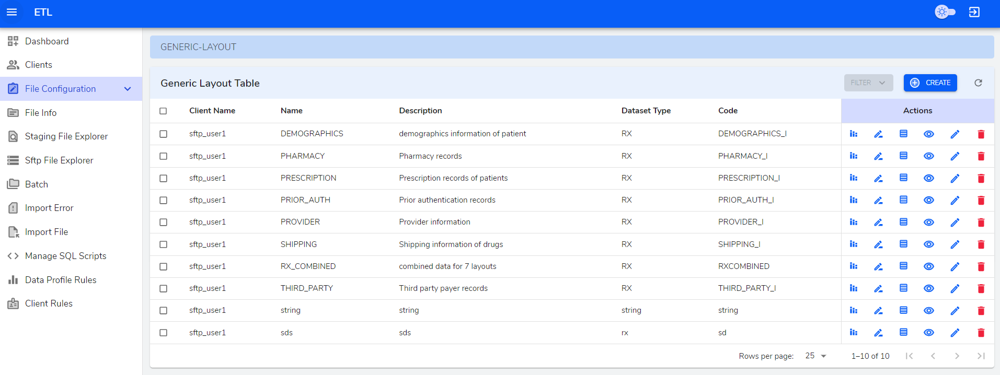
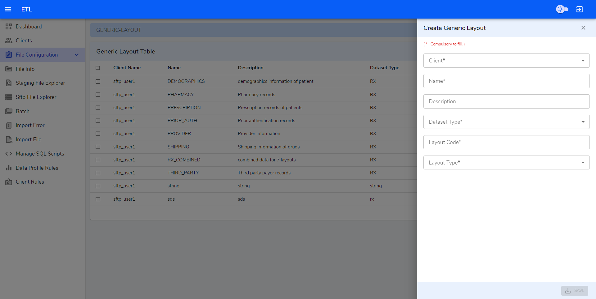
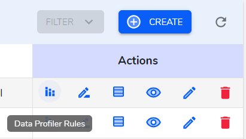

**Generic Layout Table**

In Generic Layout page we can `create/edit/view/delete` generic layouts.

**Create**

The fields whose label is marked with `*` must be filled. 

- `Client*` - A dropdown that provides list of client optoins.

-  `Name*` - A simple textfield to input client name.

- `Description*` - A simple textfield to imput description od the layout.

- `Dataset Type*` - A dropdown that provides list of dataset.

- `Layout Code*` - A simple textfield to input layout code.

- `Layout Type*` - A dropdown that provides list of layout type.

**Table Actions**

Each List Table is provided with Action columns is provided with view, edit, delete icon buttons. It also has icon buttons to view Data profiler Rules, Client Configurstion and Generic layout lines. Hovering on these icons will show what the button does in its tooltip.

**View icon button**

    View button navigates to show page where we can view the data.

<!--  -->

**Edit icon button**

   Edit button navigates to edit page where we can edit data in the form.

<!--  -->

**Delete icon button**

   Delete button opens a modal where you can confirm to delete or not. -->

<!--  -->

