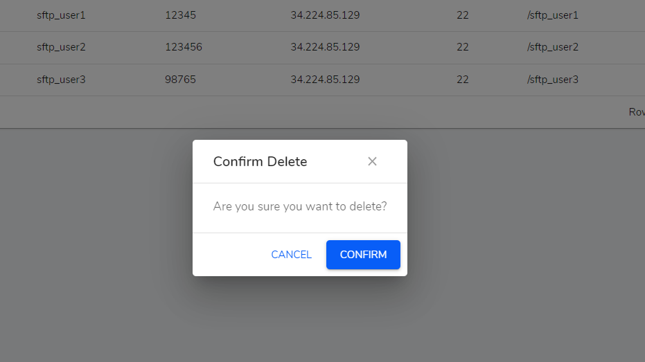

**Manage SQL Scripts table**

**Create**

The fields whose label is marked with `*` must be filled. 

- `Scripts*` - A paragraph textfield to input scripts.

-  `Name*` - A simple textfield to input name.

- `Description` - A simple textfield to input description.

- `Category*` - A dropdown that provides list of script category.

- `Type*` - A simple textfield to imput script type.

**Table Actions**

Each List Table is provided with Action columns which has view, edit icon buttons. Hovering on these icons will show what the button does in its tooltip.

**View icon button**

    View button navigates to show page where we can view the data.

<!--  -->

**Edit icon button**

   Edit button navigates to edit page where we can edit data in the form.

<!--  -->

**Delete icon button**

   Delete button opens a modal where you can confirm to delete or not.

<!--  -->